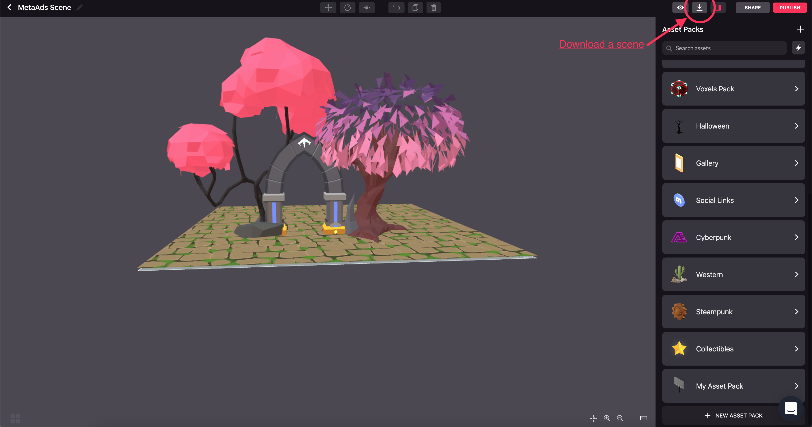
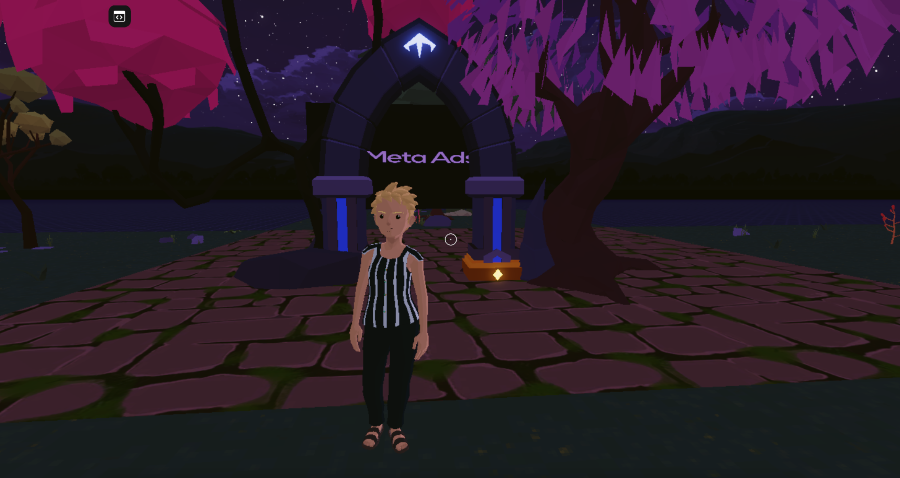
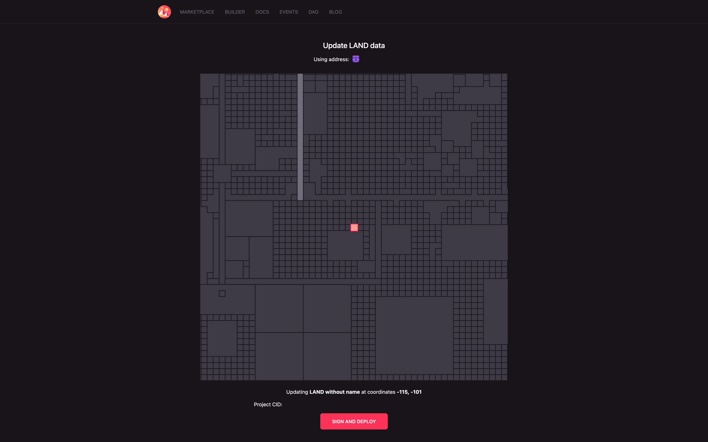

# MetaAds Decentraland's Scene

## Introduction

This document is the instruction on how to add MetaAds Typescript (Javascript + Types) to your Decentraland Scene. As a result, the back-end image/video will be displayed. This scene is created with the Decentraland SDK -- a powerful tool that allows you to create scenes written on Typescript (TS).

## 1. Install the CLI

The Command Line Interface (CLI) allows you to compile and preview your scene locally.
After testing your scene locally, you can use the CLI to upload your content to Decentraland.

You should have [Node.js](https://nodejs.org/en/) (version 14 or later) and CLI that is installed globally:

```console
npm i -g decentraland
```

> Note: If you use Mac OS or Linux, your command should run with ```sudo```

## 2. Preparing the scene

Choose from the cases. It’s possible if:

1. You already have a scene:
    + If it was created with [Builder](https://builder.decentraland.org/), you need download the scene and unzip the archive. Scene creation example is in the picture below:
    
    + If it was created with SDK, then go to step 3.
2. You don't have any scene at the moment, you need to create it with SDK. To create the scene, run: ```dcl init``` in CLI from empty dir and select *Scene*.

## 3. Adding MetaAds files

After downloading MetaAds [scene files](https://metaads.team/main/publisher/my-adspots), copy *metaAds* folder in **your** scene directory called **src**.
Open downloaded from MetaAds *game.ts* file, copy the code and paste it to the end of **your** *game.ts*.

> Note: Please, check whether your and our imports of dependencies are not intersected.

## 4. SDK Libraries

The next step is installation of dependencies we will use:

+ *decentraland-ecs-utils* (for sending requests to the server with some interval);
+ *decentraland-ecs* (for identifying parcel coords, collecting metrics from the scene and sending signed requests).

Run the following commands in your CLI:

```console
npm i decentraland-ecs@latest
npm i @dcl/ecs-scene-utils -B
```

> Note: these commands should be run in scene directory

## 5. Setup of displays

> Note: [Set up your parcel coords](https://docs.decentraland.org/development-guide/scene-metadata/#scene-parcels) in *scene.json* file before testing and deploying the scene.

There is a code block in *game.ts* that you should customize for yourself. It consists all sizes and positions for your displays.
To start, find a block in the code -- it starts from *Change these parameters* and ends with *End block*.
First parameter *n* is a number of displays that you are putting on the scene.
The next parameters are the following arrays:

+ *metaAdsScales* contains available display sizes. Size a three-component variable. First and second numbers are width and height.
Third number is dummy variable and it always equals 1, because it is a thickness, but the display is flat, so you shouldn't change it.
+ *metaAdsPositions* has the same dimension, but its three variables are x, y and z. The position of the display's center on all three axes.
+ *metaAdsImageRotations*. Euler angles, the more common x, y and z notation with numbers that go from 0 to 360.
The values are set up by default if the screen is put vertically. If you wish to rotate the display forward or backward, change the first parameter. If you wish to rotate it left or right, change the second value. And if you wish to tilt left or right, use the third parameter.
+ *metaAdsPins*. The array of display PINs that you get after ad space creation.
+ *metaAdsBoundEntities*. A list of entities to which you bind displays that works like a setParent method. If you don’t want to bind a display, set null instead of an entity.

> Note: Add to the array the same objects it already has (separated with commas) changing their contents.

> Note: The number of objects in each array should be equal to the display number *n*.

## 6. Health check

At first, run the next command (to preview the scene locally):

```console
dcl start --web3
```

A window with the scene will open automatically in your browser. You will also see a window with wallet confirmation.

> Note: Key `--web3` allows to use a wallet in local preview of the scene.
> It is optional, so you can just write ```dcl start``` and you will view the scene like a guest.



## 7. Scene Deployment

To publish the scene in Decentaland world, write this command:

```console
dcl deploy
```



After that, a new tab with a button will open. You will be able to deploy the scene there.

> Note: Confirm the deployment from your wallet pop-up window.

The link to your parcel will appear in CLI after the deployment is finished.


That's all!
